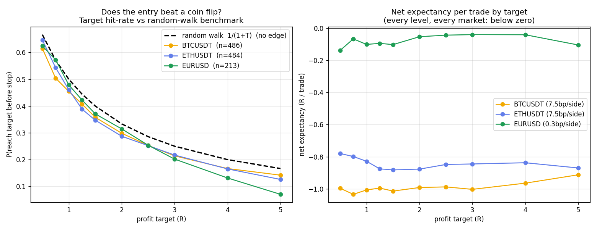

# Does the "Asia/London liquidity sweep → FVG reversal" day-trade work?

A fully reproducible backtest of a popular social-media day-trading strategy, on
1-minute data across **crypto (BTC, ETH)** and **spot FX (EUR/USD)**.

> ## TL;DR
> The strategy's **entry has no directional edge** — it reaches its profit
> targets at the same rate as a random coin flip. Because of that, **no profit
> target makes it work**, and net of realistic costs it loses money at *every*
> target in *every* market tested (1,000+ trades). The viral claim that it
> "makes you a lot of money" does not survive contact with data.



*Left: each market's target hit-rate sits on or below the "no edge" random-walk
line `1/(1+T)`. Right: net expectancy per trade is below zero at every target.*

## The strategy (as taught)

1. At the NY open, mark the **Asia** and **London** session high/low.
2. Wait for a level to be **swept** (price wicks through, closes back).
3. On the **1-minute** chart, enter the **fair-value-gap reversal** (swept a high
   → short; swept a low → long).
4. **Stop** at the sweep extreme; **target** a fixed 1:2 R, or the "next draw on
   liquidity."

## The result

| market | symbol | period | trades | best net expectancy (any target) |
|---|---|---|---:|---|
| Crypto | BTCUSDT | 2024-01 → 2025-06 | 486 | −0.91 R |
| Crypto | ETHUSDT | 2024-01 → 2025-06 | 484 | −0.78 R |
| FX | EUR/USD | 2024-06 → 2025-06 | 213 | −0.039 R |

Every cell is below zero. The decisive diagnostic: for a directionless random walk
with the stop at −1R, the chance of reaching +`T`R first is `1/(1+T)`. The
strategy's observed hit-rates sit **on or below** that line — no skill. Details,
tables, and the honest caveats are in **[METHODOLOGY.md](METHODOLOGY.md)**.

**Skimming?** Every number — the full target sweep (hit-rate vs random-walk,
gross/net expectancy) and both exit variants for all three markets — is in
**[`results/summary.csv`](results/summary.csv)**.

## Reproduce it

```bash
pip install -r requirements.txt

# Crypto (free, no auth — Binance public archive):
python3 fetch_binance.py BTCUSDT ETHUSDT --start 2024-01 --end 2025-06
python3 backtest.py data/BTCUSDT_1m.parquet --sweep

# FX (free, no auth — Dukascopy tick archive):
python3 fetch_dukascopy.py EURUSD --start 2024-06-01 --end 2025-06-01
python3 backtest.py data/EURUSD_1m.parquet --sweep --fee 0.3

# the two literal exit variants from the clip:
python3 backtest.py data/EURUSD_1m.parquet --exit both --fee 0.3

# regenerate the chart:
python3 make_charts.py
```

## Files

| file | purpose |
|---|---|
| `backtest.py` | the model + target-R sweep (`--sweep`) + exit variants (`--exit`) |
| `fetch_binance.py` | crypto 1-min from `data.binance.vision` |
| `fetch_dukascopy.py` | FX 1-min from the Dukascopy tick datafeed |
| `fetch_ibkr.py` | FX 1-min via Interactive Brokers (`ib_insync`) — alternative source |
| `make_charts.py` | regenerates `results/edge_test.png` |
| `METHODOLOGY.md` | full method, results, benchmark, and caveats |

All tunables (session windows, FVG lookahead, stop buffer, fees, min-stop filter)
are constants at the top of `backtest.py`. The conclusion is robust to reasonable
choices — change them and re-run.

## License

MIT. Data belongs to its respective providers; this repo ships code only.
